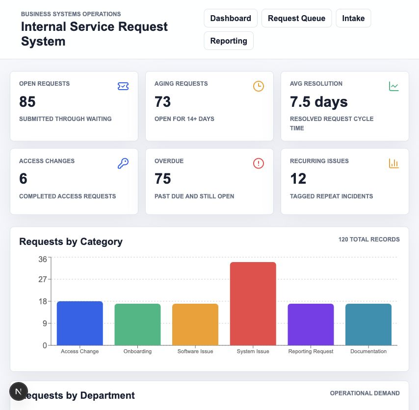
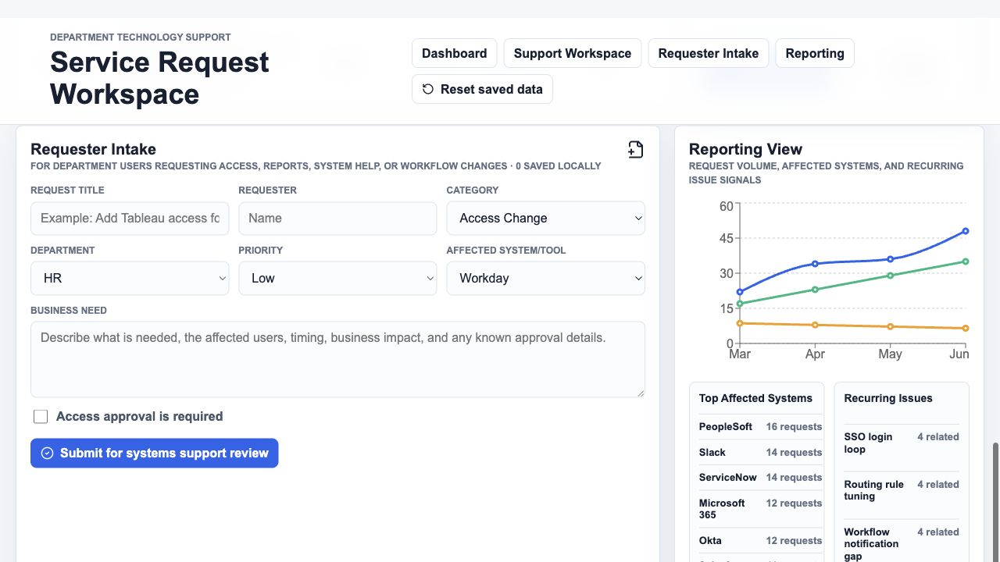

# Service Request Workspace

A department technology support workspace for managing internal service requests from intake through triage, analyst updates, resolution documentation, and operational reporting.

This project was built as a portfolio-ready Business Systems Analyst / IT application support case study. It models the type of workflow a university or department support team could use to track access changes, reporting requests, onboarding work, software issues, system issues, and documentation updates.

## Screenshots





## Why This Project Exists

Internal support teams often receive requests through email, chat, spreadsheets, or informal handoffs. That makes it harder to see what is open, who owns the work, which requests need approval, where repeat issues are happening, and whether resolution notes are documented.

Service Request Workspace turns that process into a structured workflow:

- Department users submit requests through an intake form.
- Support analysts triage requests from a searchable queue.
- Analysts update status, owner, priority, approval needs, notes, SOP links, and resolution details.
- Managers can review request volume, overdue work, access-change activity, affected systems, and recurring issue signals.

## What To Test

1. Open the dashboard and review open requests, overdue work, approval needs, access changes, and recurring issues.
2. Use the Support Workspace filters to search by request, requester, affected system, status, priority, department, or owner.
3. Select a request and update the support review fields in the detail panel.
4. Save updates, refresh the page, and confirm the changes persist.
5. Submit a new request through Requester Intake.
6. Confirm the new request appears in the queue as `Submitted` and `Unassigned`.
7. Use `Reset saved data` to clear locally saved test requests and analyst edits.

## Core Features

- Operational dashboard for open work, approval review, overdue requests, resolution time, access changes, and recurring issues.
- Searchable support queue with filters for status, priority, category, department, and assignee.
- Editable request detail panel for analyst-owned fields.
- Requester intake form for access, reporting, system help, onboarding, software, and documentation requests.
- Local persistence for submitted requests and saved analyst edits.
- Reporting view for request trends, category volume, department demand, top affected systems, and recurring issues.
- 120 realistic seed records across HR, Finance, Operations, Student Services, IT, and Athletics.

## Business Analyst / IT Support Skills Shown

- Requirements thinking for intake, triage, approvals, ownership, and resolution workflows.
- Business process design for department technology support.
- Application support concepts such as ticket status, due dates, escalation signals, affected systems, SOP links, and resolution notes.
- Data validation through required intake fields and typed request records.
- Operational reporting for workload, recurring issues, access changes, and service demand.
- User acceptance testing flow through submit, edit, save, resolve, refresh, and reset behavior.

## Persistence Model

This version uses browser `localStorage` so the demo can be tested without a backend:

- New intake submissions are saved in the current browser.
- Analyst edits are saved in the current browser.
- Refreshing the page keeps submitted requests and saved updates.
- `Reset saved data` clears local test records and restores the clean seed dataset.

Data is not shared across users or devices. A production version would use database persistence, authentication, role-based access, and audit history.

## Data Model

The app uses typed local seed data in `data/requests.ts`, with a Prisma schema prepared in `prisma/schema.prisma` for a future database-backed version.

Primary request fields include:

- `id`
- `title`
- `requester`
- `department`
- `category`
- `priority`
- `status`
- `assignedOwner`
- `submittedDate`
- `dueDate`
- `resolutionDate`
- `description`
- `internalNotes`
- `resolutionSummary`
- `documentationLink`
- `approvalRequired`
- `affectedSystem`
- `recurringIssueKey`

## Tech Stack

- Next.js
- React
- TypeScript
- Recharts
- Lucide React
- Prisma schema prepared for SQLite
- Browser `localStorage` for demo persistence

## Run Locally

```bash
npm install
npm run dev
```

Open [http://localhost:3000](http://localhost:3000).

Build check:

```bash
npm run build
```

## Future Production Improvements

- Add authentication and separate views for requesters, support analysts, and administrators.
- Move storage from `localStorage` to Postgres or SQLite through Prisma.
- Add activity history for status changes, owner changes, comments, and approvals.
- Add attachments for screenshots, files, and approval evidence.
- Add admin-managed request categories, owners, departments, and affected systems.
